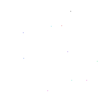

# Structural Cellular Hash Chemistry (Python + JAX)

## npj Complexity version (this branch)

This branch, `npj-complexity`, holds the code for the SCHC finite-size transition
study ("second extension") in I. Horiguchi and H. Sayama, *Hash Chemistry:
Minimal Models for Evolutionary Growth of Complexity*, npj Complexity.
The exact version used in the paper is the release
[`npj-complexity-rev1`](https://github.com/NeoGendaijin/py-hash-chemistry/releases/tag/npj-complexity-rev1),
which also carries the data archive `npj-complexity-data.tar.gz`.
The ALIFE 2026 paper uses branch `main` (tag `alife2026-camera-ready`).

Additions over `main`:
- periodic (toroidal) boundaries with periodic-aware component detection
  (`SCHCParams(periodic=True)`, `--periodic` in the scan scripts);
- a multi-GPU scan runner (`scripts/run_scan_pool.py`);
- the scripts behind the paper's SCHC figures and table
  (`scripts/generate_fig_schc_figs.py`, `scripts/transition_uncertainty.py`)
  and the data packager (`scripts/package_npj_data.py`).

Reproducing the figures and Table 2 from the released data:
```bash
pip install -e ".[paper]"                    # adds pandas, scipy, seaborn
tar -xzf npj-complexity-data.tar.gz          # at the repository root -> results/
python scripts/transition_uncertainty.py     # Table 2 with 95% intervals
python scripts/generate_fig_schc_figs.py     # figures -> results/figures_npj/
```
The contents and file formats of the archive are described in
[`docs/npj_data_README.md`](docs/npj_data_README.md).

## Evolution Dynamics

| L=200 (no runaway) | L=400, seed 8 (runaway growth) |
|:---:|:---:|
|  |  |

This repository is a Python/JAX port of the Wolfram Mathematica implementation at https://github.com/hsayama/Structural-Cellular-Hash-Chemistry. It reproduces the Structural Cellular Hash Chemistry (SCHC) model with GPU-capable simulation and figure-generation scripts approximating Figures 4, 5, and 6 from the paper (arXiv:2412.12790).

## Model overview
- 2D grid `L x L`, cell types are integers `1..k`, empty is `0`.
- Randomly pick two active cells; for each, find its 8-neighborhood connected component.
- Compute each component’s bounding box; normalize coordinates relative to its top-left; hash the normalized list to obtain a fitness value.
- Higher fitness wins; copy the winner’s bounding box (with 1-cell padding) onto the loser’s location.
  - With probability `death_prob` a copied cell becomes empty.
  - With probability `mu` it mutates to a random type in `1..k`.
  - Otherwise it is copied as-is.
- The proportion (winner size / total active cells) accumulates “elapsed time” until it exceeds 1.0 (one onestep).

## Installation
```bash
# Option A: uv (fast, reproducible)
pip install uv
uv venv .venv
source .venv/bin/activate
uv pip install -e .

# Option B: plain pip
python3 -m venv .venv
source .venv/bin/activate
pip install -e .
# For GPU (CUDA 12 example):
pip install --upgrade "jax[cuda12_local]" -f https://storage.googleapis.com/jax-releases/jax_cuda_releases.html
```

## Quick demo
```bash
uv run --python .venv/bin/python -m hash_chemistry.demo --steps 200 --size 100 --seed 0 --outfile demo.png
# or
python -m hash_chemistry.demo --steps 200 --size 100 --seed 0 --outfile demo.png
```

## API (hash_chemistry.simulation)
- `SCHCParams`: parameters (`k`, `n`, `L`, `mu`, `death_prob`)
- `SCHCState`: holds grid and RNG
- `initialize_state(key, params)`
- `advance_one_step(state, params)` / `advance_one_step_jit(state, params)`
- `run_steps(state, params, steps, callback=None)` / `run_steps_jit(state, params, steps)`

## Figure reproduction scripts
- `scripts/reproduce_paper.py`: single-run metrics + snapshots to `results/`.
- `scripts/reproduce_figs_4_5_6.py`: multiple seeds, generates approximations of the paper’s Figures 4, 5, 6 (red = individual runs, black = average) into `results/figs_4_5_6/`.
- `scripts/run_figs.sh`: helper to distribute seeds across GPUs with `nohup`.

Figure mapping:
- **Figure 4**: Max/mean fitness per step, plotted as `-log10|1 - fitness|` (improvement resolution).
- **Figure 5**: Max/mean component size per step.
- **Figure 6**: Cumulative unique cell types (top) and cumulative unique pattern types (bottom).

## Notes
- The score is a deterministic 32-bit XOR-multiply mixer over the translation-normalized coordinates and cell types of a component (`_component_fitness` in `src/simulation.py`); Mathematica’s exact `Hash` is not reproduced, but the score keeps its pattern-dependent, unpredictable variability.
- Connected components use 8-neighborhood flood fill via JAX `lax.reduce_window` + `lax.while_loop`, runnable on GPU.
- `run_steps_jit`/`advance_one_step_jit` keep loops device-side; use for long GPU runs. For stepwise inspection or callbacks, use the non-JIT variants.
